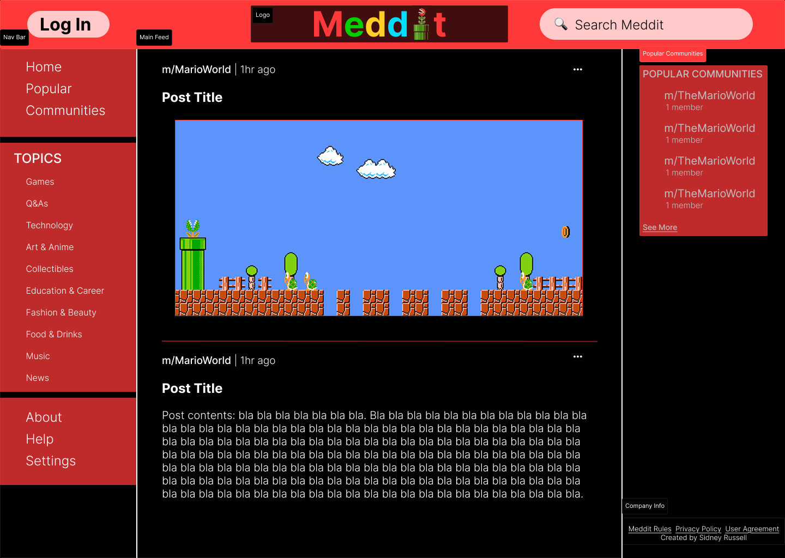

# Meddit Portfolio Project
# ⚠️ UNDER CONSTRUCTION ⚠️

## Project Overview
This is a react-based web application that allows users to browse and search *Meddit* posts. This project demonstrates the use of modern React features, including hooks, state management with Redux, routing with React Router, and API integration.

## Wireframe
Image of the figma wireframe and logo below:

## Features
### General Features
- Browse top posts from Reddit.
- Search for posts by keywords.
- Responsive design for mobile and desktop.
- Easy-to-use interface.

### State Management
- Fetches posts from a specified subreddit using the Reddit API.
- Fetches comments for a specific Reddit post using the Reddit API.
- Stores and manages fetched data in the Redux store.
- Provides actions for setting and clearing a search term.
- Includes selectors for accessing and filtering data based on the search term.
- Handles loading and error states during API calls.

## Technologies Used
- CSS
- JavaScript
- React
- Redux Toolkit
- React Router
- Reddit API

## Getting Started
The instructions below will demonstrate how to set up the project locally:

### Installation
- In your terminal, run:
`npm install npm@latest -g`
- Clone the repository:
`git clone https://github.com/sidneyrussell58/Meddit.git`
- Install NPM packages:
`npm install`
- Run app in development mode in local browser:
`npm start`

### Usage
1. Start the development server using `npm start`.
2. Open http:/localhost:3000 in your browser.
3. Log in, use the search bar to find specific posts or browse the default feed.

## License
This project is licensed under the MIT License – see the [LICENSE](LICENSE) file for details.
